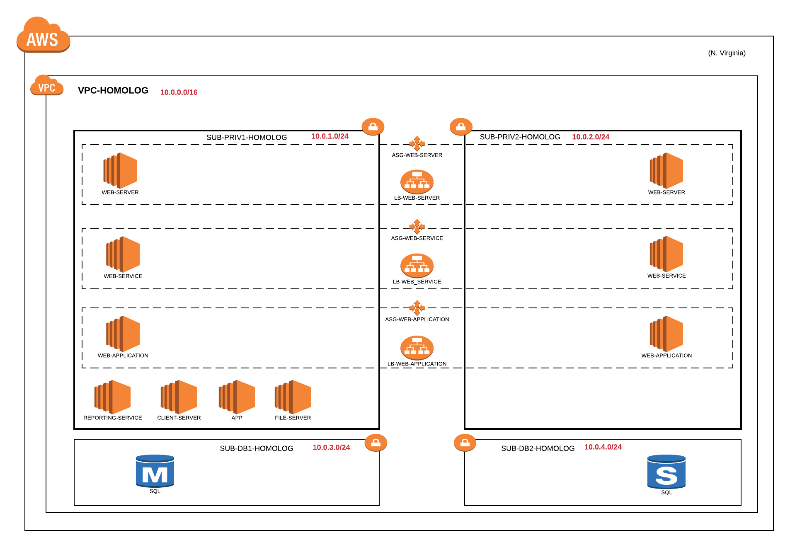

----------------------------------------------------------------------------------------------------------------                
- Website: https://www.terraform.io
- 
- Mailing list: [Google Groups](http://groups.google.com/group/terraform-tool)

 

----------------------------------------------------------------------------------------------------------------
by Angelo Moreira - SP - BRASIL - MAIO 2019 - V1.0
 
----------------------------------------------------------------------------------------------------------------
## Passo a passo:
----------------------------------------------------------------------------------------------------------------
1 - [Instalação em Linux](#INSTALAÇÃO_EM_LINUX)

wget https://releases.hashicorp.com/terraform/0.12.3/terraform_0.12.3_linux_amd64.zip \
ou https://www.terraform.io/downloads.html e efetuar o download\
unzip terraform_0.12.3_linux_amd64.zip\
cp ou mv terraform /bin\
terraform

----------------------------------------------------------------------------------------------------------------
2 - [Iniciando o Terraform](#INICIANDO_TERRAFORM)

- mkdir terraform
- cd terraform
- touch provider.tf
- vim provider.tf

colar:

provider "aws" { \
&nbsp;&nbsp;&nbsp;&nbsp;access_key = "${var.AWS_ACCESS_KEY}" \
&nbsp;&nbsp;&nbsp;&nbsp;secret_key = "${var.AWS_SECRET_KEY}" \
&nbsp;&nbsp;&nbsp;&nbsp;region = "${var.AWS_REGION}" \
} 
  
salve o arquivo 

- terraform init 

----------------------------------------------------------------------------------------------------------------
3 - [Projeto](#Projeto)

                            

- (1x) VPC com CIDR 10.0.0.0/16 nome = VPC-HOMOLOG
- (1x) Subnet privada com CIDR 10.0.1.0/24 name = SUB-PRIV1-HOMOLOG (para os servers) 
- (1x) Subnet privada com CIDR 10.0.2.0/24 name = SUB-PRIV2-HOMOLOG (para mult az dos servers) 
- (1x) Subnet privada com CIDR 10.0.3.0/24 name = SUB-DB1-HOMOLOG (para o banco de dados) 
- (1x) Subnet privada com CIDR 10.0.4.0/24 name = SUB-DB2-HOMOLOG (para mult az do banco de dados) 
- (1x) Servidor com AMI Windows Server 2012 R2 name = WEB-SERVER (para o servidor WEB front) 
- (1x) Servidor com AMI Windows Server 2012 R2 name = WEB-SERVICE (para os servicos web) 
- (1x) Servidor com AMI Windows Server 2012 R2 name = WEB-APPLICATION (para as aplicacoes) 
- (1x) Servidor com AMI Windows Server 2012 R2 name = REPORTING-SERVICE (para o servico de reporting) 
- (1x) Servidor com AMI Windows Server 2012 R2 name = CLIENT-SERVER (para o servico e testes de client) 
- (1x) Servidor com AMI Windows Server 2012 R2 name = APP (para as outras aplicacoes) 
- (1x) Servidor com AMI Windows Server 2012 R2 name = FILE-SERVER (para o servico de arquivos) 
- (1x) Grupo de autoscalling name = ASG-WEB-SERVER (para a camada de WEB-SERVER) 
- (1x) Grupo de autoscalling name = ASG-WEB-SERVICE (para a camada de WEB-SERVICE) 
- (1x) Grupo de autoscalling name = ASG-WEB-APPLICATION (para a camada de WEB-APPLICATION) 
- (1x) Load Balance application name = LB-WEB-SERVER (para a camada de WEB-SERVER) 
- (1x) Load Balance application name = LB-WEB-SERVICE (para a camada de WEB-SERVICE) 
- (1x) Load Balance application name = LB-WEB-APPLICATION (para a camada de WEB-APPLICATION)
- (1x) RDS mult AZ name = SQL (para o banco de dados SQL) 
----------------------------------------------------------------------------------------------------------------
